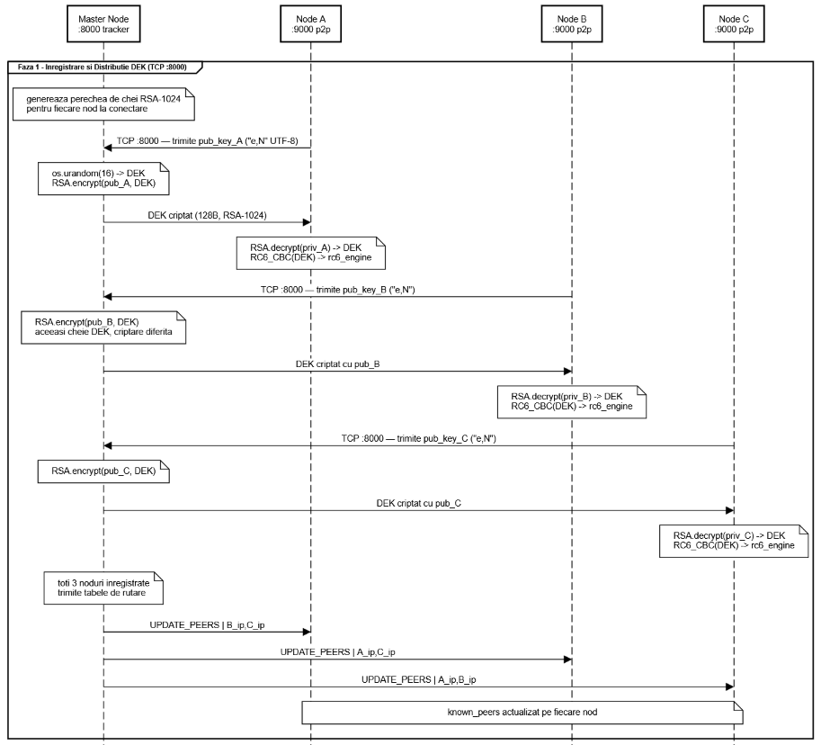
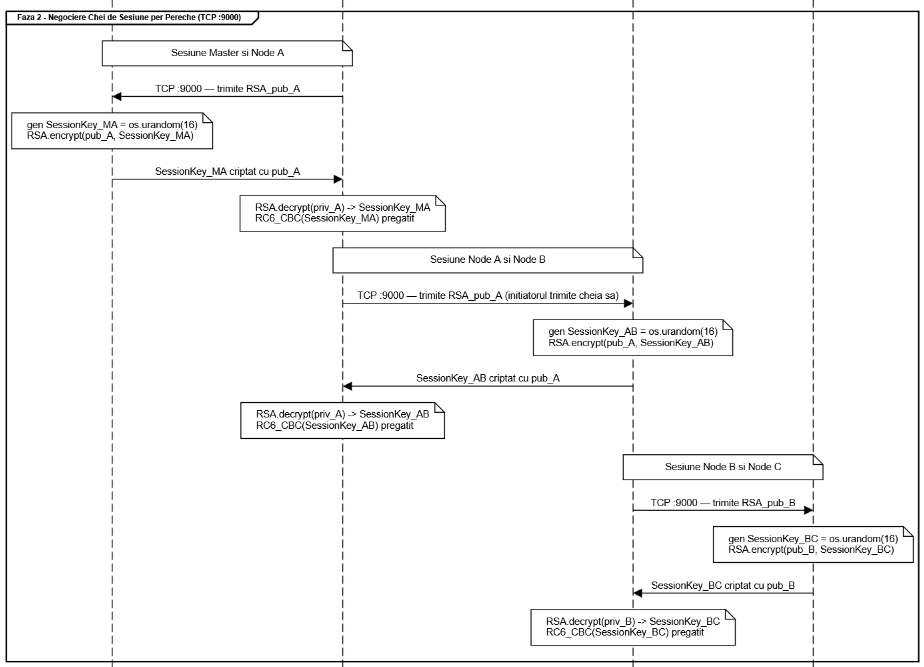
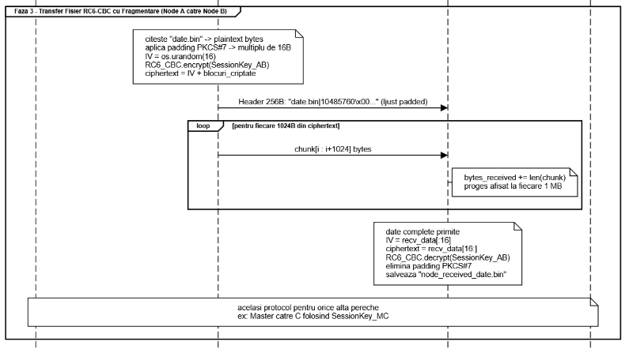
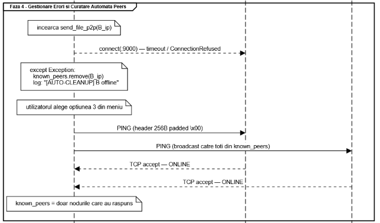

# Sistem distribuit de comunicare între stații (TCP) de transmitere point to point a mesajelor și fișierelor criptate folosind algoritmul simetric de criptare RC6

**Studenți:**  
**Lostun Șerban-Ilie**  
**Mârț Eduard**

## 1. **Arhitectura rețelei și gestionarea sesiunilor**

Proiectul implementează o topologie hibridă care îmbină un sistem centralizat de descoperire cu o comunicare complet descentralizată și securizată punct-la-punct (Peer-to-Peer). Nodul Master are rolul de a ține evidența participanților activi în rețea, funcționând ca un „tracker” care distribuie adresele IP către toate nodurile conectate. Totuși, pentru a garanta confidențialitatea deplină a transferurilor de date, aplicația a fost concepută să susțină generarea și negocierea de chei criptografice direct între participanți. Odată ce nodurile își află reciproc adresele IP prin intermediul Master-ului, ele pot iniția conexiuni directe pe un port dedicat. În cadrul acestor conexiuni directe, fiecare pereche de noduri poate negocia o cheie de criptare unică pentru sesiunea respectivă, cheie care rămâne invizibilă pentru restul rețelei. 

## 2. **Algoritmii criptografici**

A. Algoritmul Asimetric: RSA-1024 

Acest algoritm a fost dezvoltat de la zero și este utilizat pentru faza de schimb de chei (Handshake) și de autentificare inițială. Având în vedere că operațiunile matematice din RSA necesită resurse de procesare semnificative pentru volume mari de date, algoritmul este folosit exclusiv pentru a securiza transmiterea cheilor simetrice, care au o dimensiune mult mai mică. Implementarea generează numere prime mari, de câte 512 biți, folosind testul probabilitar de primalitate Miller-Rabin. Acest test asigură cu o probabilitate extrem de ridicată că numerele alese sunt prime, realizând mai multe iterații matematice bazate pe exponențieri modulare. Exponentul public a fost fixat la valoarea standard 65537 (cunoscută ca numărul prim Fermat F4), deoarece oferă un echilibru optim între securitate și eficiența calculelor. Exponentul privat, necesar decriptării, este obținut prin calcularea inversului modular cu ajutorul algoritmului lui Euclid extins. 

```py
def is_prime(n, k=5):
    if n < 2: return False
    if n in (2, 3): return True
    if n % 2 == 0: return False
    r, s = 0, n - 1
    while s % 2 == 0:
        r += 1
        s //= 2
    for _ in range(k):
        a = random.randrange(2, n - 1)
        x = pow(a, s, n)
        if x == 1 or x == n - 1:
            continue
        for _ in range(r - 1):
            x = pow(x, 2, n)
            if x == n - 1:
                break
        else:
            return False
    return True
```

```py
def generate_keypair(keysize=1024):
    p = generate_large_prime(keysize // 2)
    q = generate_large_prime(keysize // 2)
    N = p * q
    phi = (p - 1) * (q - 1)
    e = 65537
    d = mod_inverse(e, phi)
    return ((e, N), (d, N))

def encrypt(public_key, plaintext_bytes):
    e, N = public_key
    m_int = int.from_bytes(plaintext_bytes, byteorder='big')
    c_int = pow(m_int, e, N)
    num_bytes = (N.bit_length() + 7) // 8
    return c_int.to_bytes(num_bytes, byteorder='big')
```

B. Algoritmul Simetric: RC6-32/20/16 

Pentru criptarea rapidă și sigură a fișierelor și a mesajelor directe de dimensiuni mari, a fost implementat nucleul algoritmului RC6. Varianta aleasă operează pe cuvinte de 32 de biți, utilizează o cheie de 128 de biți (reprezentând 16 octeți) și aplică 20 de runde succesive de transformări criptografice asupra fiecărui bloc de date. O caracteristică matematică fundamentală a acestui algoritm, care îl face extrem de rezistent la atacurile de criptanaliză, este rotația dependentă de date: numărul de poziții cu care sunt deplasați biții dintr-un registru este determinat dinamic de valoarea conținută într-un alt registru. Procesul de extindere a cheii (Key Schedule) transformă parola inițială de 16 octeți într-un vector complex format din 44 de subchei de câte 32 de biți. Aceste subchei sunt generate folosind ecuații ce implică două constante pseudoaleatoare derivate din baza logaritmului natural și din secțiunea de aur (golden section). 

```py
def encrypt_block(self, plaintext_bytes):
    A, B, C, D = struct.unpack('<4I', plaintext_bytes)
    B = (B + self.S[0]) & self.MASK32
    D = (D + self.S[1]) & self.MASK32
    for i in range(1, 21):
        t = self.rotate_left((B * ((2 * B) + 1)) & self.MASK32, 5)
        u = self.rotate_left((D * ((2 * D) + 1)) & self.MASK32, 5)
        A = (self.rotate_left(A ^ t, u) + self.S[2 * i]) & self.MASK32
        C = (self.rotate_left(C ^ u, t) + self.S[2 * i + 1]) & self.MASK32
        A, B, C, D = B, C, D, A
    A = (A + self.S[42]) & self.MASK32
    C = (C + self.S[43]) & self.MASK32
    return struct.pack('<4I', A, B, C, D)
```

C. Modul de Operare: Cipher Block Chaining (CBC) și Padding

Deoarece nucleul algoritmului RC6 are limitarea de a procesa exclusiv blocuri fixe de exact 16 octeți, a fost dezvoltată o clasă independentă cu rol de „wrapper” pentru a permite criptarea fișierelor de dimensiuni variabile. Această clasă implementează modul de operare CBC (Cipher Block Chaining). Principiul de funcționare se bazează pe o tehnică de înlănțuire logică: înainte de a fi criptat, fiecare bloc de text este combinat, prin operația logică XOR, cu blocul de text cifrat generat anterior. Pentru primul bloc de text clar se folosește un vector de inițializare (IV) de 16 octeți, generat aleatoriu de sistemul de operare; acest vector este atașat în format necriptat la începutul pachetului de date trimis în rețea, pentru a asigura posibilitatea decriptării la destinație. Dacă dimensiunea totală a fișierului ce urmează a fi trimis nu este un multiplu perfect de 16, aplicația atașează automat la final o serie de octeți de completare (Padding), conform standardului PKCS\#7. 

```py
def encrypt(self, plaintext_bytes):
    iv = os.urandom(self.block_size)
    padded_data = self.pad(plaintext_bytes)
    ciphertext = b""
    prev_block = iv
    for i in range(0, len(padded_data), self.block_size):
        chunk = padded_data[i : i + self.block_size]
        xored_chunk = bytes(a ^ b for a, b in zip(chunk, prev_block))
        encrypted_chunk = self.core.encrypt_block(xored_chunk)
        ciphertext += encrypted_chunk
        prev_block = encrypted_chunk
    return iv + ciphertext
```

 ## 3. **Detalii de implementare a protocolului de comunicație**

A. Divizarea pachetelor de date (Chunking)

Încercarea de a transmite direct un fișier de sute de megabytes printr-un canal de comunicație de tip socket (TCP) ar suprasolicita și ar putea bloca memoria RAM a sistemului. Pentru a asigura stabilitatea transferului, protocolul P2P a fost proiectat să fragmenteze logic datele. Fiecare sesiune de transmisie este inițiată prin trimiterea unui antet (header) standardizat la exact 256 de octeți. Acest antet conține numele fișierului și dimensiunea precisă a datelor criptate ce urmează a fi transmise. Imediat după expedierea antetului, fișierul este citit de pe disc în blocuri de câte 1024 de octeți și trimis treptat. La rândul său, nodul receptor primește aceste blocuri într-o buclă repetitivă și le asamblează într-o variabilă locală până la atingerea dimensiunii totale declarate, moment în care întregul conținut este predat motorului RC6 pentru decriptare. Pe parcursul acestei bucle, programul calculează și afișează progresul descărcării, raportat la numărul de megabytes transferați. 

```py
def send_file_p2p(self, target_ip, filepath):
    with open(filepath, "rb") as f:
        plaintext = f.read()
    ciphertext = self.rc6_engine.encrypt(plaintext)
    filename = os.path.basename(filepath)
    filesize = len(ciphertext)
    header = f"{filename}|{filesize}".ljust(256, '\x00').encode('utf-8')
    s = socket.socket(socket.AF_INET, socket.SOCK_STREAM)
    s.connect((target_ip, self.p2p_port))
    s.sendall(header)
    for i in range(0, filesize, 1024):
        chunk = ciphertext[i : i + 1024]
        s.sendall(chunk)
```

B. Concurența și sincronizarea firelor de execuție

Arhitectura programului impune funcționarea simultană a mai multor procese: monitorizarea rețelei pentru conexiuni de intrare și menținerea unui meniu interactiv în consolă pentru utilizator. Întrucât operațiunile de rețea sunt blocante (întrerup execuția codului până la primirea unui pachet), a fost integrat modulul de multi-threading din Python. Serverele de ascultare sunt pornite pe fire de execuție secundare (background threads). Firul principal de execuție rămâne liber pentru a prelua comenzile de la tastatură (cum ar fi selecția expedierii unui mesaj sau a unui fișier). Pentru a asigura o oprire controlată a programului, a fost implementată o variabilă de tip „Event”. Când utilizatorul selectează opțiunea de ieșire, această variabilă declanșează oprirea coordonată a tuturor firelor secundare, evitând astfel blocajele de memorie sau procesele lăsate suspendate în sistemul de operare. 

4. **Dificultăți intâmpinate și soluții adoptate**

A. Gestionarea nodurilor deconectate abrupt 

O vulnerabilitate comună a rețelelor Peer-to-Peer constă în părăsirea subită a rețelei de către un nod (din cauza unei întreruperi a conexiunii la internet sau a închiderii forțate a aplicației), fără ca restul sistemului să fie înștiințat. Inițial, când Master-ul sau un alt nod încerca să expedieze date către o adresă IP stocată în memoria locală, dar care nu mai corespundea unui sistem activ, protocolul de transmisie eșua critic, generând o eroare fatală de tip „conexiune refuzată”. Rezolvarea acestei dificultăți a constat în dezvoltarea unui mecanism propriu de interogare (Keep-Alive / PING). Prin selectarea opțiunii de reîmprospătare din interfața aplicației, sistemul inițiază conexiuni scurte către toate adresele IP stocate, setând o limită de așteptare de exact o secundă. Adresele cu care nu se poate stabili o conexiune în acest interval de timp sunt declarate oficial offline și șterse automat din lista locală de rutare. În cazul nodului Master, orice modificare de acest gen declanșează obligatoriu transmiterea listei actualizate de contacte către toți membrii rămași disponibili, restabilind astfel integritatea rețelei. 

B. Alinierea vectorului de inițializare la decriptare 

Pe parcursul testelor de transfer a fost identificată o problemă severă în etapa de decriptare a fișierelor: dacă datele nu erau aliniate corespunzător la intrarea în motorul CBC, întregul text rezultat consta în secvențe corupte. Dificultatea apărea din cauză că vectorul de inițializare era lipit direct de corpul mesajului criptat pe rețea, iar algoritmul de decriptare trebuia să știe exact unde se termină cheia de pornire și unde începe mesajul propriu-zis. Soluția tehnică a fost standardizarea riguroasă a funcției de extracție la recepție. Programul a fost conceput să izoleze forțat primii 16 octeți din orice calup de date primit, pe care îi atribuie variabilei IV, utilizând apoi strict restul caracterelor pentru procesul iterativ de decriptare inversă. Această abordare garantează demontarea precisă a structurii CBC creată la momentul criptării, indiferent de dimensiunea totală a fișierului transferat.

```py
def decrypt(self, encrypted_data_and_iv):
    iv = encrypted_data_and_iv[:self.block_size]
    actual_ciphertext = encrypted_data_and_iv[self.block_size:]
    plaintext_padded = b""
    prev_block = iv
    for i in range(0, len(actual_ciphertext), self.block_size):
        chunk = actual_ciphertext[i : i + self.block_size]
        decrypted_chunk = self.core.decrypt_block(chunk)
        plaintext_chunk = bytes(a ^ b for a, b in zip(decrypted_chunk, prev_block))
        plaintext_padded += plaintext_chunk
        prev_block = chunk
    return self.unpad(plaintext_padded)
```

# Topologia:

  


  

**Faza 1 — Înregistrare și distribuție DEK** 

La pornire, fiecare nod generează local o pereche de chei RSA-1024: o cheie publică (e, N) și una privată (d, N). Ulterior, nodul se conectează la Master pe portul 8000 și transmite cheia publică serializată sub forma unui șir de caractere („e,N”). 

Nodul Master primește cheia, generează o cheie simetrică de rețea (DEK) folosind 16 octeți generați aleatoriu prin funcția os.urandom(16), o criptează cu cheia publică a nodului respectiv și o trimite înapoi. Nodul decriptează mesajul cu cheia sa privată pentru a recupera DEK-ul în clar, moment în care inițializează motorul de criptare RC6-CBC folosind această cheie. Acest proces se repetă pentru fiecare nod în parte. Deși DEK-ul este identic pentru întreaga rețea, fiecare participant primește o versiune criptată în mod unic, pe care doar el o poate decifra. 

După ce toate nodurile s-au înregistrat, Master-ul trimite pe portul 9000 al fiecăruia un mesaj de tip UPDATE\_PEERS, care conține adresele IP ale celorlalte noduri active. Fiecare nod salvează această listă în variabila known\_peers, excluzând, desigur, propriul IP. 

**Faza 2 — Negociere chei de sesiune per pereche** 

Înaintea oricărui transfer de date, cele două noduri implicate negociază o cheie de sesiune unică, complet secretă. Nodul inițiator transmite cheia sa publică RSA către destinatar, utilizând portul 9000\. Destinatarul generează, la rândul său, o nouă cheie de sesiune pe 16 octeți (folosind os.urandom(16)), pe care o criptează cu cheia publică primită și o trimite înapoi. 

Inițiatorul o decriptează apoi folosind propria cheie privată. Prin urmare, fiecare pereche de noduri împarte o cheie de sesiune distinctă. Astfel, chiar dacă nodurile posedă același DEK global al rețelei, transferurile directe dintre ele beneficiază de o protecție suplimentară datorită acestei chei unice per sesiune. 

**Faza 3 — Transfer de fișiere cu RC6-CBC și fragmentarea** 

Utilizatorul selectează din meniul interactiv un destinatar (peer) și un fișier. Nodul citește fișierul de pe disc, aplică algoritmul de completare PKCS\#7 pentru ca dimensiunea datelor să devină un multiplu de 16 octeți, generează un vector de inițializare (IV) aleatoriu de 16 octeți și criptează totul prin metoda RC6-CBC, utilizând cheia de sesiune. 

Rezultatul final constă în concatenarea IV-ului (primii 16 octeți) cu textul cifrat (ciphertext). Sistemul construiește apoi un antet (header) de exact 256 de octeți, având formatul „**nume\_fișier|mărime**”, diferența de spațiu fiind completată cu caractere null. Antetul este expediat primul, fiind urmat de textul cifrat, care este fragmentat și transmis în calupuri (chunk-uri) de câte 1024 de octeți. 

La recepție, procesul de ascultare (listener) de pe portul 9000, care rulează pe un fir de execuție separat (thread), citește primii 256 de octeți aferenți antetului și identifică tipul mesajului. Acesta reasamblează toate fragmentele primite, extrage IV-ul din primii 16 octeți, decriptează restul datelor cu motorul RC6-CBC, elimină padding-ul PKCS\#7 și salvează fișierul pe disc adăugându-i prefixul **node\_received\_**. În cazul mesajelor text directe, antetul conține specificatorul **DIRECT\_MSG**, iar conținutul decriptat este afișat direct în terminal. 

**Faza 4 — Gestionarea erorilor și curățarea automată de Peers**

În cazul în care un nod încearcă să transmită date, iar conexiunea eșuează din cauza expirării timpului de așteptare (timeout) sau a refuzului conexiunii (eroare de tip **ConnectionRefused**), adresa IP a destinatarului este ștearsă automat din lista **known\_peers**, iar în terminal se afișează un mesaj de atenționare marcat cu \[AUTO-CLEANUP\]. Opțiunea a treia din meniul interactiv emite un semnal de tip PING — reprezentat printr-un antet de 256 de octeți completați exclusiv cu caractere null — către toți partenerii din lista **known\_peers**. Nodurile care răspund acestui semnal sunt menținute în listă, în timp ce participanții inactivi sunt eliminați. Astfel, se asigură faptul că lista de contacte este actualizată constant și conține doar noduri confirmate ca fiind active. 
